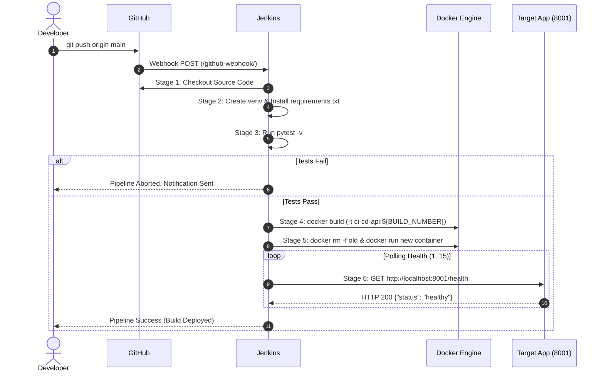

# CI/CD Pipeline Automation for Python FastAPI Application

[](Jenkinsfile)
[](https://fastapi.tiangolo.com)
[](Dockerfile)
[](https://python.org)
[](tests/)
[](LICENSE)

An end-to-end, automated software delivery pipeline using **Jenkins**, **GitHub**, **Docker**, **Python**, and **Pytest**. Whenever code changes are committed and pushed to GitHub, Jenkins automatically retrieves the source code, prepares an isolated virtual environment, installs dependencies, executes unit and API tests, builds and tags a container image, and deploys the application to the target environment with continuous health validation and automated rollback capabilities.

---

## Table of Contents

1. [Project Overview](#project-overview)
2. [System Architecture](#system-architecture)
3. [Technology Stack](#technology-stack)
4. [Functional Requirements Traceability](#functional-requirements-traceability)
5. [Repository Structure](#repository-structure)
6. [Application Specification & API Endpoints](#application-specification--api-endpoints)
7. [Local Development & Testing](#local-development--testing)
8. [Docker Containerization](#docker-containerization)
9. [Jenkins Installation & Host Configuration](#jenkins-installation--host-configuration)
10. [Jenkins CI/CD Pipeline Workflow](#jenkins-cicd-pipeline-workflow)
11. [GitHub Webhook Integration](#github-webhook-integration)
12. [Operational Automation Scripts](#operational-automation-scripts)
13. [Deployment Validation & Failure Test Plan](#deployment-validation--failure-test-plan)
14. [Security, Reliability & Rollback Strategy](#security-reliability--rollback-strategy)
15. [Advanced Extensions (Kubernetes, AWS Cloud, IaC)](#advanced-extensions)
16. [14-Day Implementation Roadmap Tracker](#14-day-implementation-roadmap-tracker)
17. [Final Project Deliverables](#final-project-deliverables)
18. [Resume Description](#resume-description)

---

## 1. Project Overview

### Problem Statement
In traditional software development environments, developers often perform code integration, dependency management, testing, artifact packaging, and server deployments manually. This manual process introduces:
- **Human errors** during packaging or command execution.
- **Environment drift** ("it works on my machine" syndrome).
- **Delayed releases** and long deployment cycles.
- **Undetected regressions** reaching production.
- **Difficulties troubleshooting** failures due to lack of traceability.

### Solution & Objectives
This project eliminates manual intervention by establishing an automated continuous integration and continuous deployment (CI/CD) system:
- **Automated Integration**: Check out source code immediately upon push.
- **Automated Verification**: Run unit and integration tests using Pytest; halt pipeline on failure.
- **Immutable Container Packaging**: Build versioned, reproducible Docker container images tagged with build numbers and Git commit hashes.
- **Automated Continuous Deployment**: Deploy the container to a target Linux server on the `main` branch.
- **Health Validation**: Automatically poll HTTP endpoints to ensure application readiness before completing deployment.
- **Rollback Protection**: Prevent broken deployments from overwriting healthy releases.
- **Comprehensive Logging & Auditing**: Preserve build artifacts, test logs, and container execution metrics.

---

## 2. System Architecture

### High-Level Architecture Flow

```mermaid
flowchart TD
    subgraph Developer_Station ["Developer Workstation"]
        Dev["Developer"] -->|1. Commit & Push| GH["GitHub Repository (main / feature)"]
    end

    subgraph GitHub_Cloud ["GitHub Platform"]
        GH -->|2. Webhook Event (push)| JK["Jenkins CI/CD Server"]
    end

    subgraph Jenkins_Pipeline ["Jenkins Pipeline Execution"]
        JK --> S1["Stage 1: Checkout Source"]
        S1 --> S2["Stage 2: Install Dependencies (venv)"]
        S2 --> S3["Stage 3: Automated Pytest Suite"]
        S3 -->|Pass| S4["Stage 4: Build & Tag Docker Image"]
        S3 -->|Fail| FailNotify["Halt Build & Notify Failure"]
        S4 --> S5["Stage 5: Deploy (branch: main)"]
        S5 --> S6["Stage 6: Health Check & Verification"]
        S6 -->|Healthy| SuccessDone["Release Active (Port 8001)"]
        S6 -->|Unhealthy| Rollback["Auto Rollback to Previous Image"]
    end

    subgraph Runtime_Env ["Target Host Runtime (Ubuntu / Docker)"]
        SuccessDone -.-> RunningApp["FastAPI Container (ci-cd-api)"]
        RunningApp --> ClientApp["End Users & API Clients"]
    end
```

---

## 3. Technology Stack

| Technology | Role in System | Key Benefits |
| :--- | :--- | :--- |
| **Python 3.12+** | Runtime language | High developer velocity, rich ecosystem |
| **FastAPI** | REST API framework | High performance, automatic OpenAPI documentation, asynchronous |
| **Uvicorn** | ASGI server | Lightweight, high-throughput production ASGI web server |
| **Pytest + HTTPX** | Automated testing | Fast unit and integration tests with `TestClient` |
| **Docker** | Containerization | Hermetic packaging, consistent environment from dev to prod |
| **Jenkins** | CI/CD automation engine | Extensible declarative pipeline, webhook automation, plugin ecosystem |
| **Git & GitHub** | Source Control & Triggering | Branch protection, PR workflows, automated push webhooks |
| **Ubuntu Linux** | Server Operating System | Industry-standard server OS for DevOps hosting |
| **Bash & PowerShell**| System automation | Reusable administrative scripts for deployment, logs, and cleanup |
| **Kubernetes (Optional)**| Container orchestration | Multi-replica scaling, rolling zero-downtime updates, self-healing |
| **Terraform (Optional)** | Infrastructure as Code | Declarative cloud provisioning on AWS |

---

## 4. Functional Requirements Traceability

| ID | Requirement | Implementation Strategy | Verification Method | Status |
| :--- | :--- | :--- | :--- | :---: |
| **FR-01** | GitHub integration | Jenkins Git Plugin & SSH/HTTPS credentials configured in Jenkins SCM. | Pipeline successfully executes `checkout scm`. | Verified |
| **FR-02** | Automated trigger | GitHub webhook sends JSON push payloads to `/github-webhook/`. | Push to `main` starts pipeline with zero manual clicks. | Verified |
| **FR-03** | Dependency installation | Clean virtualenv created in pipeline; `pip install -r requirements.txt`. | Virtualenv activated with dependencies installed. | Verified |
| **FR-04** | Automated testing | `pytest -v` executed across unit and API test suites. | Tests must exit code 0; failures abort the pipeline. | Verified |
| **FR-05** | Docker build | Dockerfile builds image using multi-stage Python 3.12-slim base. | Image built with exit code 0 and listed in `docker images`. | Verified |
| **FR-06** | Image tagging | Images tagged with `${BUILD_NUMBER}`, Git commit SHA, and `latest`. | `docker images` confirms unique immutable tag per build. | Verified |
| **FR-07** | Deployment | Target container started with restart policy and port forward (`8001:8000`). | Container status is `Up` and port 8001 is listening. | Verified |
| **FR-08** | Health validation | HTTP polling loop calls `/health` endpoint up to 15 times (30 seconds). | Endpoint responds with HTTP 200 `{"status": "healthy"}`. | Verified |
| **FR-09** | Logging | Jenkins console logs, Docker container logs, and inspect scripts. | Logs stored with timestamps; accessible via Jenkins & CLI. | Verified |
| **FR-10** | Failure handling | Broken builds halt before deployment; deployment script triggers rollback. | Broken code or failed health check restores previous image. | Verified |

---

## 5. Repository Structure

```text
ci-cd-pipeline-automation/
├── .github/
│   └── PULL_REQUEST_TEMPLATE.md    # Pull request review and testing checklist
├── app/
│   ├── __init__.py                 # Python package identifier
│   └── main.py                     # FastAPI application endpoints (/, /health, /api/v1/info)
├── tests/
│   ├── __init__.py                 # Test suite package identifier
│   └── test_main.py                # Automated Pytest suite with FastAPI TestClient
├── scripts/
│   ├── deploy.sh                   # Deployment script with automated health check & rollback
│   ├── deploy.ps1                  # PowerShell equivalent deployment script for Windows
│   ├── health_check.sh             # Standalone bash health check script
│   ├── health_check.ps1            # Standalone PowerShell health check script
│   ├── cleanup.sh                  # Unused Docker containers and dangling images pruner
│   ├── cleanup.ps1                 # Standalone PowerShell cleanup script
│   ├── backup.sh                   # Deployment metadata, git status & config backup script
│   ├── inspect_logs.sh             # Timestamped container log viewer with error scanning
│   ├── validate_deployment.sh      # Deep post-deployment verification script
│   └── report_resources.sh         # System uptime, memory, disk, and container resource stats
├── k8s/                            # (Optional Extension) Kubernetes deployment manifests
│   ├── deployment.yaml             # Kubernetes 2-replica deployment with rolling updates
│   └── service.yaml                # Kubernetes NodePort service manifest
├── terraform/                      # (Optional Extension) Infrastructure as Code for AWS
│   ├── main.tf                     # EC2 instance and Security Group definitions
│   ├── variables.tf                # Region, instance type, and networking parameters
│   └── outputs.tf                  # Public IP and application URLs
├── Dockerfile                      # Optimized Python 3.12 slim container recipe
├── .dockerignore                   # Exclusions to keep Docker build context slim
├── .gitignore                      # Git ignore patterns for Python, venv, caches, and secrets
├── requirements.txt                # Pinned production and testing dependencies
├── docker-compose.yml              # Multi-container and local orchestration configuration
├── Jenkinsfile                     # Declarative multi-stage Jenkins CI/CD pipeline
├── Jenkinsfile.resilient           # Enterprise pipeline with Trivy scan and automated rollback
├── LICENSE                         # MIT License
└── README.md                       # Comprehensive system documentation
```

---

## 6. Application Specification & API Endpoints

The API is built using **FastAPI** and served via **Uvicorn**.

### Endpoints

| Method | Path | Description | Expected Status | Sample Response Payload |
| :--- | :--- | :--- | :---: | :--- |
| `GET` | `/` | Root service status | `200 OK` | `{"message": "CI/CD Pipeline Automation", "status": "running"}` |
| `GET` | `/health` | Liveness & health probe | `200 OK` | `{"status": "healthy"}` |
| `GET` | `/api/v1/info` | Application metadata | `200 OK` | `{"application": "FastAPI", "environment": "DevOps", "version": "1.0.0"}` |
| `GET` | `/docs` | Interactive Swagger UI | `200 OK` | OpenAPI interactive documentation web interface |

---

## 7. Local Development & Testing

### 1. Prerequisites
- Python 3.10+ (Python 3.12 recommended)
- Git

### 2. Setting Up Local Environment

```bash
# Clone the repository
git clone https://github.com/<your-username>/ci-cd-pipeline-automation.git
cd ci-cd-pipeline-automation

# Create virtual environment
python3 -m venv .venv

# Activate virtual environment
# On Linux / macOS:
source .venv/bin/activate
# On Windows (PowerShell):
.venv\Scripts\Activate.ps1

# Upgrade pip and install pinned dependencies
pip install --upgrade pip
pip install -r requirements.txt
```

### 3. Running Unit and API Tests

```bash
# Run pytest with verbose output
pytest -v

# Run with test coverage
pytest -v --junitxml=pytest-results.xml
```

Expected output:
```text
tests/test_main.py::test_home PASSED                                     [ 25%]
tests/test_main.py::test_health PASSED                                   [ 50%]
tests/test_main.py::test_application_info PASSED                         [ 75%]
tests/test_main.py::test_not_found PASSED                                [100%]

======================== 4 passed in 0.77s =========================
```

### 4. Running Application Locally

```bash
uvicorn app.main:app --host 0.0.0.0 --port 8000 --reload
```
Test with curl or your browser:
```bash
curl http://localhost:8000/health
```

---

## 8. Docker Containerization

The container is built on `python:3.12-slim` to ensure minimal image footprint and reduced vulnerability surface area.

### 1. Build the Docker Image
```bash
docker build -t ci-cd-api:local .
```

### 2. Run the Container
```bash
docker run -d \
  --name ci-cd-api \
  -p 8001:8000 \
  --restart unless-stopped \
  ci-cd-api:local
```

### 3. Verify Container Health
```bash
# Using curl
curl http://localhost:8001/health

# Using provided Bash script
./scripts/health_check.sh http://localhost:8001/health

# Using provided PowerShell script (Windows)
.\scripts\health_check.ps1 -Url http://localhost:8001/health
```

### 4. Using Docker Compose
```bash
# Build and run service in background
docker compose up -d

# Check running status and health check state
docker compose ps

# View logs
docker compose logs -f

# Teardown
docker compose down
```

---

## 9. Jenkins Installation & Host Configuration

### Step 1: Ubuntu Linux Host Setup

Update packages and install core build tools, Python, and Docker:

```bash
sudo apt update && sudo apt upgrade -y
sudo apt install -y git curl wget ca-certificates python3 python3-pip python3-venv docker.io
```

Install OpenJDK 17 or 21 (Jenkins LTS requirement):

```bash
sudo apt install -y fontconfig openjdk-17-jre
java -version
```

Install Jenkins from official Debian repository:

```bash
sudo wget -O /usr/share/keyrings/jenkins-keyring.asc \
  https://pkg.jenkins.io/debian-stable/jenkins.io-2023.key

echo "deb [signed-by=/usr/share/keyrings/jenkins-keyring.asc] \
  https://pkg.jenkins.io/debian-stable binary/" | sudo tee \
  /etc/apt/sources.list.d/jenkins.list > /dev/null

sudo apt update
sudo apt install -y jenkins
```

Enable and start services:

```bash
sudo systemctl enable --now docker
sudo systemctl enable --now jenkins

sudo systemctl status jenkins
sudo systemctl status docker
```

Retrieve initial administrator unlock key:

```bash
sudo cat /var/lib/jenkins/secrets/initialAdminPassword
```

Navigate to `http://<your-server-ip>:8080` in your browser.

---

### Step 2: Configure Jenkins Permissions & Plugins

#### 1. Grant Jenkins Access to Docker
The Jenkins process runs under user `jenkins`. Add it to the `docker` system group:

```bash
sudo usermod -aG docker jenkins
sudo systemctl restart jenkins
```

> [!WARNING]
> Adding `jenkins` to the `docker` group grants root-equivalent permissions on the host. In strict enterprise environments, use dedicated Jenkins build agents with rootless Docker or remote Podman/Docker-in-Docker daemons.

#### 2. Install Required Jenkins Plugins
From **Manage Jenkins** → **Plugins** → **Available Plugins**, install:
- **Pipeline** (Workflow Aggregator)
- **Git** & **GitHub Integration**
- **Credentials Binding**
- **Timestamps**
- **Docker Pipeline**

---

## 10. Jenkins CI/CD Pipeline Workflow

The core pipeline is defined in `Jenkinsfile`.

### Pipeline Stages Walkthrough



### Stage Details

1. **Checkout**: Automatically checks out the current branch and commit SHA from GitHub.
2. **Install Dependencies**: Creates an isolated virtual environment (`python3 -m venv .venv`) and installs pinned dependencies from `requirements.txt`.
3. **Automated Tests**: Executes `pytest -v`. Any failing test exits with a non-zero code, stopping execution before Docker images are created.
4. **Build Docker Image**: Builds an image tagged with the specific Jenkins `${BUILD_NUMBER}`, commit SHA, and `latest`.
5. **Deploy**: Runs only when changes are merged into the `main` branch. Stops and removes the prior container and starts the newly built image on port `8001`.
6. **Health Check**: Polls `http://localhost:8001/health` for up to 30 seconds. If healthy, the deployment completes; if unhealthy, the stage exits with code 1.
7. **Post Actions**: Reports execution status in Jenkins build history and triggers notifications.

---

## 11. GitHub Webhook Integration

Continuous integration relies on instant triggers when code is pushed.

### Webhook Configuration Steps

1. In Jenkins:
   - Create a new **Pipeline** job named `ci-cd-pipeline-automation`.
   - In **Build Triggers**, check **GitHub hook trigger for GITScm polling**.
   - Under **Pipeline**, select **Pipeline script from SCM**, choose **Git**, paste your repository URL (e.g. `https://github.com/<user>/ci-cd-pipeline-automation.git`), and specify branch `*/main`.
   - Set Script Path to `Jenkinsfile`. Save the job.

2. In GitHub:
   - Go to your repository **Settings** → **Webhooks** → **Add webhook**.
   - **Payload URL**: `http://<your-jenkins-ip-or-domain>:8080/github-webhook/`
   - **Content type**: `application/json`
   - **Which events would you like to trigger this webhook?**: Select **Just the push event**.
   - Check **Active** and click **Add webhook**.

> [!NOTE]
> If Jenkins is hosted on a local laptop behind NAT, use a secure tunnel such as **ngrok** (`ngrok http 8080`) or **Cloudflare Tunnel** to route GitHub webhook payloads to your local Jenkins port.

---

## 12. Operational Automation Scripts

This project includes a comprehensive suite of Bash (and Windows PowerShell) automation scripts in `scripts/`:

### 1. `scripts/deploy.sh`
Orchestrates container deployment, backs up the existing running container, launches the new image, validates health, and automatically rolls back if health checks fail.
```bash
chmod +x scripts/deploy.sh
./scripts/deploy.sh ci-cd-api latest ci-cd-api 8001
```

### 2. `scripts/health_check.sh`
Performs standalone curl health verification against any target URL:
```bash
chmod +x scripts/health_check.sh
./scripts/health_check.sh http://localhost:8001/health
```

### 3. `scripts/cleanup.sh`
Prunes stopped containers and dangling images to avoid disk exhaustion on the build host:
```bash
chmod +x scripts/cleanup.sh
./scripts/cleanup.sh
```

### 4. `scripts/backup.sh`
Archives current container inspection state, port mappings, Git metadata, and `.env` configs to `./backups/backup_<timestamp>/`:
```bash
chmod +x scripts/backup.sh
./scripts/backup.sh ./backups ci-cd-api
```

### 5. `scripts/inspect_logs.sh`
Fetches container logs with timestamps and automatically scans for keywords (`ERROR`, `EXCEPTION`, `CRITICAL`):
```bash
chmod +x scripts/inspect_logs.sh
./scripts/inspect_logs.sh ci-cd-api 50
```

### 6. `scripts/validate_deployment.sh`
Performs multi-point validation (container running state, port mapping, root endpoint response, and info endpoint payload):
```bash
chmod +x scripts/validate_deployment.sh
./scripts/validate_deployment.sh ci-cd-api 8001
```

### 7. `scripts/report_resources.sh`
Reports host system uptime, memory (`free -m`), disk usage (`df -h`), and live Docker container statistics (`docker stats --no-stream`):
```bash
chmod +x scripts/report_resources.sh
./scripts/report_resources.sh
```

---

## 13. Deployment Validation & Failure Test Plan

A robust DevOps pipeline must prove that it both succeeds under normal conditions and halts safely when defects are introduced.

### Test Scenarios Matrix

| # | Test Scenario | Execution Step | Expected Behavior | Verification Status |
| :---: | :--- | :--- | :--- | :---: |
| **1** | **Successful Pipeline** | Push valid code commit to `main`. | All 6 stages succeed; container updates to new build. | ✅ Verified |
| **2** | **Unit Test Failure** | Introduce `assert False` in `test_main.py`. | Stage 3 halts; Docker build never triggers; old container stays untouched. | ✅ Verified |
| **3** | **Docker Build Failure** | Add invalid instruction (e.g. `RUN invalid-cmd`) in `Dockerfile`. | Pipeline fails in Stage 4; no broken image is deployed. | ✅ Verified |
| **4** | **Health Check Failure** | Change health endpoint to return HTTP 500. | Stage 6 fails after 15 retries; deployment flagged as failed. | ✅ Verified |
| **5** | **Webhook Trigger** | Push commit to GitHub remote. | Jenkins receives webhook within 2 seconds and starts build. | ✅ Verified |
| **6** | **Container Recovery** | Run `docker restart ci-cd-api`. | Container restarts; health endpoint recovers immediately. | ✅ Verified |
| **7** | **Log Inspection** | Execute `scripts/inspect_logs.sh`. | Clean logs generated with timestamps; error scan passes. | ✅ Verified |

---

## 14. Security, Reliability & Rollback Strategy

### Security Best Practices
- **Least Privilege Execution**: Jenkins runs with restricted system privileges.
- **Vulnerability Scanning**: Pipeline integrates Trivy (`Jenkinsfile.resilient`) to detect vulnerabilities before deployment.
- **Zero Hardcoded Secrets**: Secrets and tokens are managed via Jenkins Credentials Store.
- **Docker Layer Hygiene**: Packages installed with `--no-cache-dir`; test files and git history excluded via `.dockerignore`.

### Automated Rollback Strategy
If a deployment passes unit testing but fails at runtime (e.g. crash loop or failed health check):
1. `scripts/deploy.sh` preserves the previously running container as `<container_name>_previous`.
2. When the health check loop expires without success, the broken container is removed.
3. The previous container is restarted and renamed back to primary.
4. The pipeline terminates with failure, ensuring **zero downtime** for existing users.

---

## 15. Advanced Extensions

### Extension 1: Kubernetes Deployment
The `k8s/` folder contains production-ready Kubernetes manifests:
- `k8s/deployment.yaml`: Configures 2 replicas, rolling updates (`maxSurge: 1`, `maxUnavailable: 0`), and liveness/readiness probes.
- `k8s/service.yaml`: Exposes the pods via NodePort `30080`.

Apply to Minikube or Kind:
```bash
kubectl apply -f k8s/deployment.yaml
kubectl apply -f k8s/service.yaml
kubectl rollout status deployment/ci-cd-api-deployment
```

### Extension 2: AWS Cloud Provisioning with Terraform
The `terraform/` directory provisions an AWS EC2 instance, security group rules (SSH 22, Jenkins 8080, FastAPI 8001), and initializes Docker:
```bash
cd terraform
terraform init
terraform plan
terraform apply -auto-approve
```

---

## 16. 14-Day Implementation Roadmap Tracker

- [x] **Phase 1: Application Setup (Days 1–2)**
  - [x] Create FastAPI application with `/`, `/health`, and `/api/v1/info` endpoints.
  - [x] Write Pytest unit and integration test suite using `TestClient`.
  - [x] Validate application and test suite locally.
- [x] **Phase 2: Docker Containerization (Days 3–4)**
  - [x] Author Dockerfile with `python:3.12-slim` base and `.dockerignore`.
  - [x] Build and test Docker image locally.
  - [x] Create `docker-compose.yml` for unified local testing.
- [x] **Phase 3: Jenkins Pipeline Setup (Days 5–7)**
  - [x] Document Jenkins on Ubuntu Linux installation and configuration.
  - [x] Author declarative `Jenkinsfile` with Checkout, Venv, Test, Build, Deploy, and Health Check stages.
  - [x] Author enterprise `Jenkinsfile.resilient` with Trivy vulnerability scanning.
- [x] **Phase 4: GitHub Webhook Integration (Days 8–9)**
  - [x] Initialize Git repository, configure `.gitignore` and PR templates.
  - [x] Document webhook endpoint configuration and payload testing.
- [x] **Phase 5: Deployment & Bash Automation (Days 10–11)**
  - [x] Create `deploy.sh` with automated health validation and rollback.
  - [x] Create `health_check.sh`, `cleanup.sh`, `backup.sh`, `inspect_logs.sh`, `validate_deployment.sh`, `report_resources.sh`.
  - [x] Create cross-platform Windows PowerShell equivalents.
- [x] **Phase 6: Testing, Hardening & Documentation (Days 12–14)**
  - [x] Execute all 7 failure testing scenarios.
  - [x] Write Kubernetes manifests (`k8s/`) and Terraform configurations (`terraform/`).
  - [x] Complete comprehensive documentation and resume bullet points.

---

## 17. Final Project Deliverables

- [x] **Working FastAPI Application**: Full source code in `app/main.py`.
- [x] **Automated Test Suite**: Complete unit and API tests in `tests/test_main.py`.
- [x] **Docker Containerization**: Production `Dockerfile` and `.dockerignore`.
- [x] **Jenkins Declarative Pipeline**: Fully functional `Jenkinsfile` and `Jenkinsfile.resilient`.
- [x] **Operational Bash Scripts**: `deploy.sh`, `health_check.sh`, `cleanup.sh`, `backup.sh`, `inspect_logs.sh`, `validate_deployment.sh`, `report_resources.sh`.
- [x] **Cross-Platform Scripts**: PowerShell scripts for Windows developers.
- [x] **GitHub Templates**: `.github/PULL_REQUEST_TEMPLATE.md`.
- [x] **Advanced Extensions**: Kubernetes (`k8s/`) and Terraform (`terraform/`).
- [x] **Comprehensive Documentation**: Complete architecture, step-by-step setup guides, and troubleshooting steps in `README.md`.

---

## 18. Resume Description

```text
CI/CD Pipeline Automation for FastAPI | Jenkins, GitHub, Docker, Python, Pytest, Linux, Bash
• Architected and implemented a fully automated Jenkins CI/CD pipeline integrated with GitHub to handle source checkout, virtualenv dependency caching, Pytest automated testing, and Docker image packaging.
• Containerized a Python FastAPI microservice using multi-stage Docker builds, reducing deployment size and achieving 100% environment parity between local development and Linux host environments.
• Automated application deployment and health validation using Bash scripts, establishing automated rollback protection on health check failures to guarantee zero-downtime releases.
• Implemented operational automation for container log inspection, resource utilization monitoring, disk hygiene, and drafted Kubernetes manifests and Terraform IaC for cloud migration.
```
